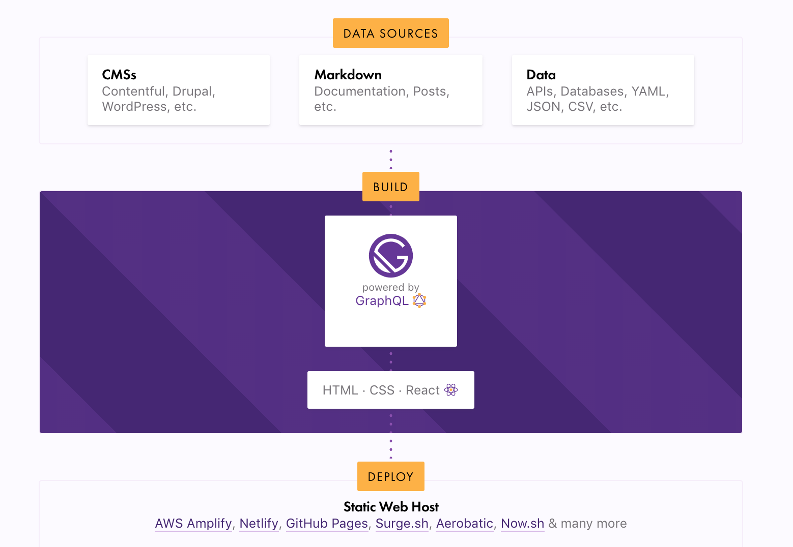

Gatsby는 React를 기반으로 한 WebSite 빠르게 만들고 배포할 수 있는 무료 오픈 소스 프레임워크 입니다.

> Gatsby 가 동작하는 방식은 DataSource - Build - Deploy 로 구분할 수 있습니다,  
> DataSource 에서는 배포할 웹페이지에서 사용하고 싶은 데이터 형식으로 Data 를 추가하고  
> Build 과정에서는 GraphQL을 이용하여 Data 를 가져와서 React 컴포넌트에 주입할 수 있습니다.  
> 마지막으로 deploy 하면 끝!

글로 설명하기에는 어렵기 때문에! 하나 하나씩 해보면서 블로그를 올려보려고 합니다.

1. Gatsby - Hello World
2. Data Source File 설정 및 사용하기
3. MarkDown 문서를 Data Source File 로 사용하기
4. MarkDown 문서로 페이지 추가하기
5. image 설정 추가 및 사용하기
6. Font 설정 하기
7. 배포
