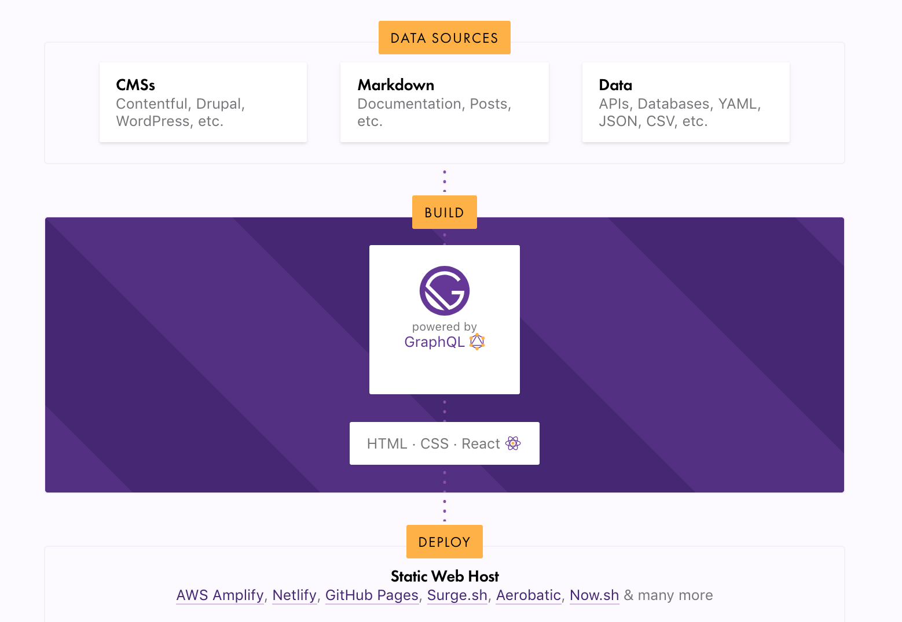

안녕하세요! 
이제 부터라도 블로그를 작성해보려고 하는 뉴비 ... 개발자 입니다  
우선 블로그를 작성할 수 있는 플랫폼은 굉장히 다양하지만,  
제가 요즘 많이 다루고 있는 React 기반인 Gatsby를 활용하여 블로그를 차차 작성해 보려고 합니다  
이번 포스트에서는 Gatsby 를 간단하게 소개한 후 개발 환경을 설정하도록 하겠습니다.  

### Gatsby 소개
Gatsby는 React를 기반으로 한 WebSite 빠르게 만들고 배포할 수 있는 무료 오픈 소스 프레임워크 입니다.

> Gatsby 가 동작하는 방식은 DataSource - Build - Deploy 로 구분할 수 있습니다,  
> DataSource 에서는 배포할 웹페이지에서 사용하고 싶은 데이터 형식으로 Data 를 추가하고  
> Build 과정에서는 GraphQL을 이용하여 Data 를 가져와서 React 컴포넌트에 주입할 수 있습니다.  
> 주입된 데이터를 가지고 웹사이트에서 정상적으로 보여지면 deploy(배포) 하고 끝!

대충 이런 내용이지만 ... 제가 작성했지만 무슨말인지 모르겠네요...  
차근차근 포스트를 추가해가면서 설명드리겠습니다  

1. Gatsby - Intro
2. Gatsby - Hello World
3. Gatsby - Styling
4. Gatsby - Data Source
5. Gatsby - MarkDown
6. Gatsby - Image
7. Gatsby - plguin
8. Gatsby - deploy
