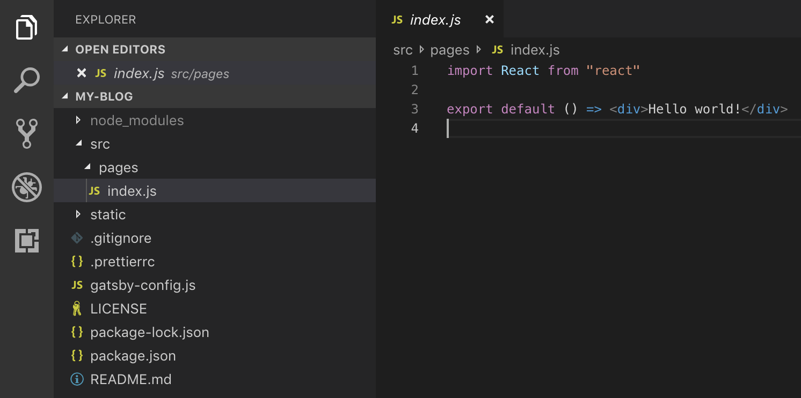
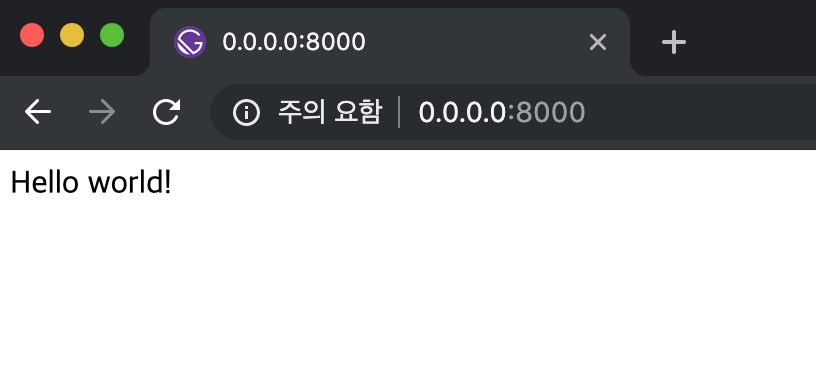

안녕하세요, 오늘은 Gatsby 초기 설정 및 Hello World 를 띄워보겠습니다.  
먼저 node 설치가 안되신 분들은 설치를 해주시고 글을 읽어주세요  
그리고 React에 대한 아주 기본적인 내용을 모르신다면 조오금 어려울 수 있기 때문에  
따로 학습이 필요합니다 ... ㅜㅜ 제가 꼭 다음 포스트에 리액트를 소개하도록 하겠습니다!  
저는 mac book 으로 개발하고 있는 점 참고 부탁드립니다!  

### Gatsby Hello World
우선 저희는 "Hello World" 기반으로 프로젝트를 생성해보겠습니다.  
먼저 터미널을 실행시킨 후에 아래 명령어를 실행시켜주세요  
```SHEEL
> npx gatsby new my-blog https://github.com/gatsbyjs/gatsby-starter-hello-world
```  

실행시킨 명령어의 구조는 아래와 같습니다
```SHEEL
> npx gatsby new [프로젝트 폴더명] [Gatsby 템플릿 깃 레포 주소]  
```

### Gatsby develop 실행
이제 코드를 열어보시면 아래 사진과 같이 "src/pages/index.js" 코드를 확인하실 수 있습니다.

이후 터미널에서 `npx gatsby develop` 를 실행시켜주세요


> 이제 index.js 파일을 자유롭게 수정해보세요
> gatsby 에서는 수정사항을 즉시 반영해주기 때문에 
> 실행하신 브라우저에서 바로바로 변경사항을 보실 수 있습니다

