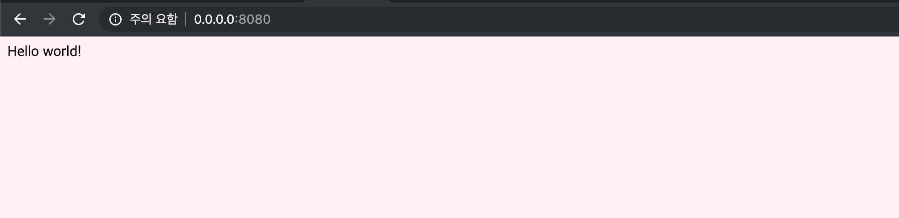
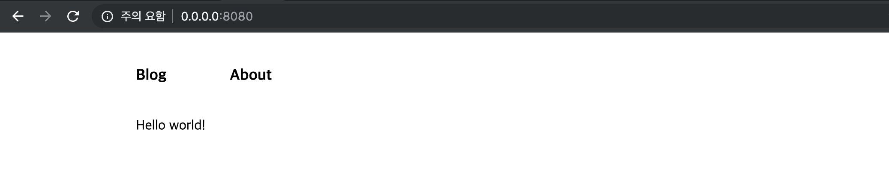

안녕하세요, 오늘은 layout을 만들어 보려고 합니다.  
layout을 만드는 이유는 일관된 페이지 구성을 전달하기 위해서 사용합니다  
layout에 헤더 바, 본문, 네비게이션 등을 구현한 후 여러 페이지에서 적용할 수 있어요!

### Typography

웹 사이트를 좀 더 예쁘게 하기 위한 툴킷 입니다.

```shell
npm install --save gatsby-plugin-typography react-typography typography typography-theme-fairy-gates
```

typography 설치 후 my-blog 폴더에 있는 gatsby-config.js 파일 수정이 필요한데요
아래와 같이 수정하시면 됩니다.

```
# gatsby-config.js

module.exports = {
  plugins: [
    {
      resolve: `gatsby-plugin-typography`,
      options: {
        pathToConfigModule: `src/utils/typography`,
      },
    },
  ],
}
```

- gatsby-config.js : Gatsby 사이트 설정 옵션들을 정의하는 파일

추가로 코드 내에서 사용할 typography 옵션을 정의하도록 하겠습니다
정의할 파일은 gatsby-config.js 에서 pathToConfigModule 에 정의한 위치에 해주셔야 합니다.
다르게 사용하고 싶으시면 pathToConfigModule 과 정의한 파일의 위치만 일치하면 되겠죠?!

```javascript
import Typography from "typography"
import fairyGateTheme from "typography-theme-fairy-gates"

const typography = new Typography(fairyGateTheme)

export const { scale, rhythm, options } = typography
export default typography
```

> _gatsby-browser.js_ (skip 해도 됨)
> Gatsby 는 정적 웹 사이트이긴 하지만 페이지가 로드된 후에 동적으로
> 데이터를 처리할 수 있는 이점이 있습니다.
> 페이지 분석 이벤트 처리 , 스크롤 처리 등을 처리할 수 있습니다
> 더 알고 싶으시다면 해당 페이지 참고-> [gatsby browser api](https://www.gatsbyjs.org/docs/browser-apis/)

global.css 파일 수정 사항

```css
body {
  background: lavenderblush;
}
```

gatsby-browser.js 파일 수정 사항

```javascript
import "./src/styles/global.css"
```

수정 결과물 `npx gatsby develop`


### Component scoped css

컴포넌트 영역의 요소들에만 css 를 적용할 수 있도록 해줍니다.  
웹 페이지의 헤더 부분을 만들어 보겠습니다.
저는 components 아래에 header 폴더를 만들어서  
header.js 파일 및 header.css 파일을 생성했습니다.

```
├── package.json
├── src
│   └── components
│       └── header
│           ├── header.js
│           └── header.module.css
```

css 파일의 확장자는 보통 .css 파일로 끝나지만,  
Gatsby 에서 css module 로 처리하기 위해 .module.css 로 사용됩니다~

header.module.css 파일

```css
.container {
  position: fixed;
  display: flex;
  top: 0;
  flex-direction: row;
  align-items: center;
  height: 100px;
  width: 100%;
  background: inherit;
  z-index: 1;
}

.item {
  font-size: 18px;
  font-weight: bold;
  margin-right: 74px;
}
```

header.js 파일

```javascript
import React from "react"
import headerStyle from "./header.module.css"

const Header = () => (
  <div className={headerStyle.container}>
    <div className={headerStyle.item}>Blog</div>
    <div className={headerStyle.item}>About</div>
  </div>
)

export default Header
```

마지막으로 global.css 파일 수정 사항입니다.

```css
body {
  padding: 0;
  margin: 0;
  display: flex;
  flex-direction: column;
  justify-content: center;
  align-items: center;
  background: #ffffff;
}
```

오늘 최종 결과물 입니다.

